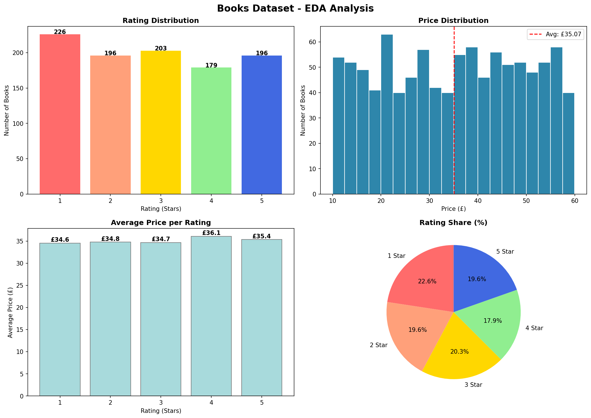

# 📊 Exploratory Data Analysis - Books Dataset

## 🎯 Project Overview
Performed complete EDA on 1000 books dataset collected from books.toscrape.com.

## ❓ Key Questions Answered
| Question | Answer |
|----------|--------|
| Total Books | 1000 |
| Average Price | £35.07 |
| Cheapest Book | An Abundance of Katherines - £10.00 |
| Most Expensive | The Perfect Play - £59.99 |
| 5-Star Books | 196 books |
| Most Common Rating | 1 Star (226 books) |

## 📋 Data Structure
| Column | Type | Null Values |
|--------|------|-------------|
| Title | str | 0 |
| Price (£) | float64 | 0 |
| Rating (1-5) | int64 | 0 |
| Availability | str | 0 |
| URL | str | 0 |

## 📈 Statistical Summary
| Metric | Price (£) | Rating |
|--------|-----------|--------|
| Mean | 35.07 | 2.92 |
| Min | 10.00 | 1 |
| Max | 59.99 | 5 |
| Std | 14.44 | 1.43 |

## 🔍 Anomalies Detected
- ✅ No duplicate titles
- ✅ No missing values
- ⚠️ Price below £10: 0 books
- ⚠️ Price above £50: 187 books

## 🛠️ Tools Used
- Python 3
- Pandas
- Matplotlib
- Seaborn

## ▶️ How to Run
```bash
pip install pandas matplotlib seaborn openpyxl
python EDA_Analysis.py
```

## 📁 Files
- `EDA_Analysis.py` - Main EDA script
- `CodeAlpha TASK-1.xlsx` - Dataset
- `eda_charts.png` - Visualization output

## 🖼️ Visualizations

